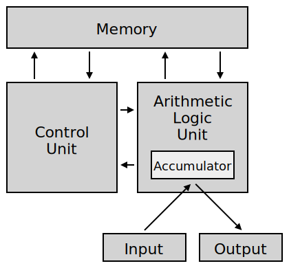
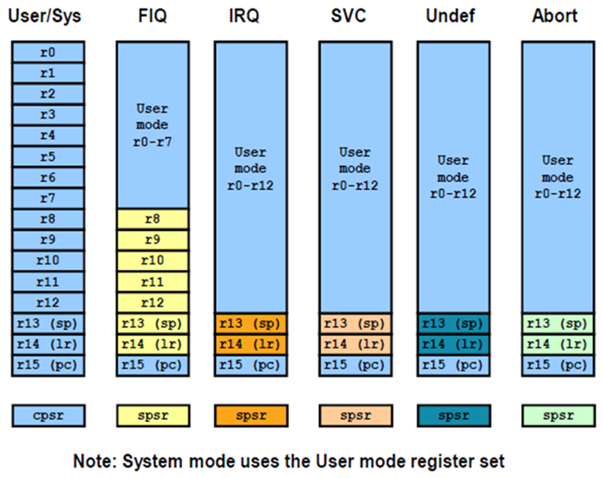
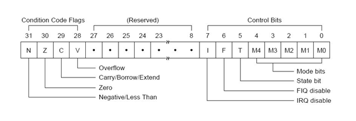
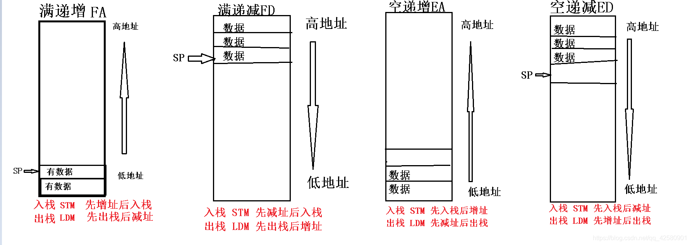
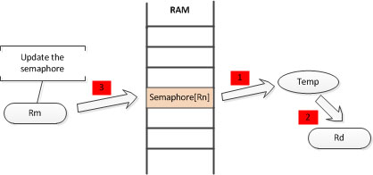
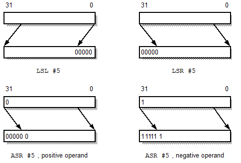
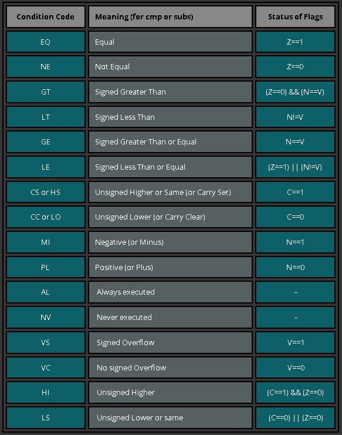

## ARM ##

Thumb指令集

        Thumb指令可以看做是ARM指令壓縮形式，是種16-bit指令模式
        功能性較少，許多指令無法存取CPU暫存器
        可提供更佳的編碼密度，代碼密度為單位儲存空間內的指令個數
        EX: 再1K的空間下，可放32條 32-bit command或 64條 16-bit command
        有些運算需要更多行指令，但在記憶體埠或匯流排寬度限制條件下能更有效運用

        Thumb指令在分支指令中的一部分可以與ARM指令集切換，Thumb的數據處理
        指令則都能映射到相應的ARM數據處理指令，但LDR/STR/LDM/STM指令不能互
        相替換。

        差異:
        1. THUMB: 偽指令CODE16, ARM: CODE32偽指令
        2. Thumb數據處理指令採用2地址格式
        3. 條件跳轉與ARM代碼下的跳轉相比，在範圍上有更多的限制
        4. Access暫存器R8—R15的Thumb數據處理指令不能更新CPSR中的ALU狀態
        5. 在Thumb狀態下，LDR/STR/LDM/STM指令只能訪問寄存器R0—R7


1. CISC
2. RISC -> ARM (范紐曼型架構) - 程式指令記憶體和資料記憶體放在一起



(出處 https://zh.wikipedia.org/zh-tw/%E5%86%AF%C2%B7%E8%AF%BA%E4%BC%8A%E6%9B%BC%E7%BB%93%E6%9E%84)

        1. Load/Store: 需要將資料搬至REG才能做處理，完成後再存回去
        2. 固定指令長度、單週期指令
        3. 使用更多REG來存資料
        差異:
        1. 有桶型移位REG(特定位元shift)，單週期可做更多操作
        2. 有些指令非單週期
        3. 16 bit THUMB指令集
        4. 條件執行
        5. 增加DSP, SIMD\NEON

        ARM has multiple work mode
        user mode 無法對kernel或driver做事
        FIQ mode > IRQ
        IRQ mode (獨享R8-R12 register)
        supervisor mode
        abort mode
        undefined mode
        system mode
        monitor mode


(出處: https://roboticelectronics.in/arm-registers/)

        暫存器: R0~R15, CPSP, SPSR
        R13 = Stack Point (SP) 當前正在執行的function
        R14 = Link Register (LR) 上一個執行的function
        R15 = Program counter (PC) 每取一次指令 就會+1 (= SP + 8)
CPSR



(出處: https://www.ques10.com/p/41159/arm7-a-32-bit-microcontrollerpart-2-1/)

        Bit 0~4 : 處理器模式
        Bit 5(T) : 0: ARM instruction, 1: Thumb instruction
        Bit 6(F) : 1 -> 禁止FIQ中斷
        Bit 7(I) : 1 -> 禁止IRQ中斷
        Bit 28(V) : 1 -> overflow
        Bit 29(C) : Carry bit
        Bit 30(Z) : 0 -> 運算結果為0, 1 -> 運算結果不為0
        Bit 31(N) : 0 -> 運算結果為正, 1 -> 運算結果為負
SPSR -> 用來保存當前的CPSR

3. EPIC
4. VLIW

## ARM instruction ##
指令格式
```
<opcode> {<cond> {s} <Rd>, <Rn> {, <operand2>}}
opcode -> MOV, ADD, ...
cond -> 執行條件
s -> 是否影響CPSR
Rd -> target register
Rn -> operation register
operand2 -> 第二個可選操作
```
儲存訪問指令 LDR/STR

        LDR R1, [R0] => R1 = *R0，從位址 R0 載入到 R1 (4 byte)
        LDR R0, [R1, R2] -> R0 = R1 + R2
        LDR R0, [R1, R2] ! -> R0 = R1 + R2, R1 = R1 + R2
        LDR R0, [R1], R2 -> R0 = R1, R1 = R1 + R2
        STR R1, [R0] => *R0 = R1, 把 R1 寫到位址 R0 (4 byte)
        LDRB/STRB => 同上 只使用 1 byte
        LDM => 從記憶體載入多筆資料到一般用途暫存器
        LDM R0, {R1-R4,PC} ->
        R1 = * R0
        R2 = *(R0+4)
        R3 = *(R0+8)
        R4 = *(R0+12)
        PC = *(R0+16)
        STM => 多個暫存器的資料在一個指令下寫回記憶體
        STM R0, {R1-R4,LR} ->
        *R0 = R1
        *(R0+4) = R2
        *(R0+8) = R3
        *(R0+12) = R4
        *(R0+16) = LR

有四種data操作模式 (搭配LDM/STM)
| mode | 說明 |
| ---  | --- |
| Increase After (IA) | 每次傳送後位置加4，寄存器由左至右執行 |
| Increase Before (IB) | 每次傳送前位置加4，寄存器由左至右執行 |
| Decrease After (DA) | 每次傳送後位置減4，寄存器由右至左執行 |
| Decrease Before (ED) | 每次傳送後位置減4，寄存器由右至左執行 |

有四種stack操作模式 (搭配LDM/STM)
| mode | 說明 |
| ---  | --- |
| Full Ascending (FA) | 堆疊往高位址的記憶體空間成長，堆疊最頂端的有效資料位址 |
| Full Descending (FD) | 堆疊往低位址的記憶體空間下降，堆疊最底端的有效資料位址 |
| Empty Ascending (EA) | 堆疊往高位址的記憶體空間成長，堆疊最頂端有效資料欄位再往上的空資料位址 |
| Empty Descending (ED) | 堆疊往低位址的記憶體空間下降，堆疊最底端有效資料欄位再往下的空資料位址 |



(出處: https://blog.csdn.net/qq_42580901/article/details/106127362)

ARM -> 使用 Full Descending (FD), FILO

        LDMFD SP!, {R0-R2,R14} ->
        R0 = * SP!
        R1 = *(SP!+4)
        R2 = *(SP!+8)
        R14 = *(SP!+12)
        STMFD SP!, {R0-R2,R14} ->
        *SP! = R0
        *(SP!+4) = R1
        *(SP!+8) = R2
        *(SP!+12) = R14
SWP

        SWP R1, R2, [R0] ->
        *R1 = R0
        *R0 = R2
SWP Rd, Rm, [Rn]



(出處: https://mcu.eetrend.com/content/2018/100012321.html)

POP/PUSH -和LDMFD/STMFD用法類似

        PUSH {R0-R2,R14}
        POP {R0-R2,R14}
MOV -暫存器間資料傳遞

        MOV {cond} {s} Rd, operand2
        MVN {cond} {s} Rd, operand2
        cond -> 執行條件
        s -> 是否影響CPSR EX:MOVS表示會影響
        ---
        MOV R1, #1 -> R1 = 1
        MOV R1, R0 -> R1 = R0
        MOV PC, LR -> 回到上一個function
        MVN R0, #0xFF -> R0 = ~(0xFF)
        MVN R0, R1 -> R0 = ~(R1)
邏輯運算

        ADD {cond} {s} <Rd>, <Rn> {, <operand2>} 加法
        EX. ADD R2, R1, #1 -> R2 = R1 + 1
        ADC {cond} {s} <Rd>, <Rn> {, <operand2>} 帶進位加法
        EX. ADC R1, R1, #1 -> R1 = R1 + 1 + C (C = CPSR進位值)
        SUB {cond} {s} <Rd>, <Rn> {, <operand2>} 減法
        EX. SUB R1, R1, R2 -> R1 = R1 - R2
        SBC {cond} {s} <Rd>, <Rn> {, <operand2>} 帶進位減法
        EX. SBC R1, R1, R2 -> R1 = R1 - R2 - C
        AND {cond} {s} <Rd>, <Rn> {, <operand2>} AND運算
        EX. AND R0, R0, #3 -> R0 = R0 & #3
        ORR {cond} {s} <Rd>, <Rn> {, <operand2>} OR運算
        EX. ORR R0, R0, #3 -> R0 = R0 | #3
        EOR {cond} {s} <Rd>, <Rn> {, <operand2>} XOR運算
        BIC {cond} {s} <Rd>, <Rn> {, <operand2>} 位元清除
operand2

指令可使用第二參數，可以是(常數)或(暫存器+偏移)

        #constant, n -> #constant >> n
        ASR, #n -> 算術右移n位
        LSL, #n -> 邏輯左移n位
        LSR, #n -> 邏輯右移n位
        ROR, #n -> 循環右移n位
        RRX -> 循環右移1位，帶擴展
        type Rs -> type如上，R0為暫存器

        ADD R3, R2, R1, LSL #3 -> R3 = R2 + R1<<3
        ADD R3, R2, R1, LSL R0 -> R3 = R2 + R1<<R0
        ADD IP, IP, #16, 20 -> IP = IP + #16>>20

        Notice: 算術和邏輯差別
        1. 邏輯位移無論左移還是右移都是補0
        2. 算術位移左移補0，右移補1


(source: https://stackoverflow.com/questions/14565444/arm-assembly-arithmetic-shift-logical-shift)

比較指令

比較指令會影響CPSR中的N、Z、C、V

        CMP {cond} Rn, operand2 -> 比較兩個數，運算結果影響N、Z、C、V
        CMN {cond} Rn, operand2 -> 取負比較，運算結果影響N、Z、C、V
        CMP R1, #10 -> R1 - 10
        CMP R1, R2 -> R1 - R2
        CMN R0, #1 -> R0 - (-1)

條件執行指令



(source: https://azeria-labs.com/arm-conditional-execution-and-branching-part-6/)

跳轉指令

        B {cond} label -> 跳至label [0~32MB]
        B {cond} Rm -> 跳至Rm中的位置
        BL {cond} label -> 會將下一條指令存至LR再跳
        BX {cond} label -> 切換狀態(ARM/thumb)再跳轉
        BLX {cond} label -> 混和BL和BX用法

ARM 尋址方式

(source: http://www.only2fire.com/archives/65.html)

        1.立即數尋址 - 操作數為常數
        EX: ADD R1, R1, #1 or MOV R1, #12
        2.寄存器尋址 - 通過寄存器可直接操作
        EX: MOV R1, R2
        3.寄存器間接尋址 - RAM和寄存器間資料傳遞，指標操作
        EX: LDR R1, [R2] -> R1 = *R2
        4.基址尋址 - 也是寄存器間接尋址，差別在於將寄存器和一個偏移量相加
        EX: LDR R2,[R3,#0x0C] -> R2=*(R3+0x0C)
        5.寄存器移位尋址 - 將第二個操作數operand2作為新的操作數
        EX: MOV R2, R1, LSL, #3 (R2 = R1<<3)
        6.堆棧尋址 - 處理目標為Stack Pointer(SP)
        EX: STMFD  SP!, ｛R1－R7, LR｝
        7.多寄存器尋址 - 一次傳輸多個寄存器的值(MAX 16個)
        EX: LDMIA R1!, {R2-R7,R12}
        8.塊拷貝尋址 - 一次將多個寄存器的值存回RAM
        EX: STMIA  R0!, ｛R1—R7｝
        9.相對尋址 - 屬於基址尋址，以PC作為基準並用指令的地址差做為偏移
        兩者相加得到一個新的位置 EX: B, BL
        偏移量為B LOOP 到 LOOP間的偏移

        Note:
        ARM指令中可帶有!符號
        意思為將最後的地址寫回基址寄存器，如果沒帶有!符號則基址不改變
        ^ 符號 -> 會將SPSR複製到CPSR，寄存器是使用user mode而非當前使用的模式