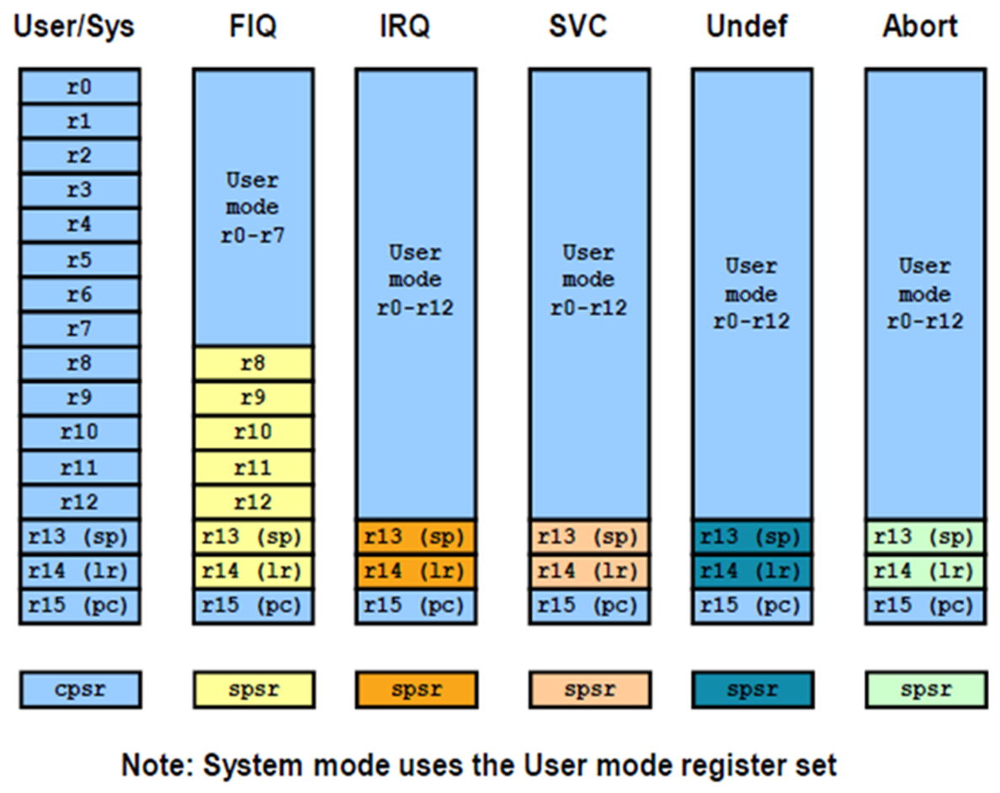

## ARM ##

1. CISC
2. RISC -> ARM (范紐曼型架構) - 程式指令記憶體和資料記憶體放在一起


(出處 https://zh.wikipedia.org/zh-tw/%E5%86%AF%C2%B7%E8%AF%BA%E4%BC%8A%E6%9B%BC%E7%BB%93%E6%9E%84)

        1. Load/Store: 需要將資料搬至REG才能做處理，完成後再存回去
        2. 固定指令長度、單週期指令
        3. 使用更多REG來存資料
        差異:
        1. 有桶型移位REG(特定位元shift)，單週期可做更多操作
        2. 有些指令非單週期
        3. 16位THUMB指令集
        4. 條件執行
        5. 增加DSP, SIMD\NEON

        ARM has multiple work mode
        user mode 無法對kernel或driver做事
        FIQ mode > IRQ
        IRQ mode (獨享R8-R12 register)
        supervisor mode
        abort mode
        undefined mode
        system mode
        monitor mode


(出處: https://roboticelectronics.in/arm-registers/)

        暫存器: R0~R15, CPSP, SPSR
        R13 = Stack Point (SP) 當前正在執行的function
        R14 = Link Register (LR) 上一個執行的function
        R15 = Program counter (PC) 每取一次指令 就會+1 (= SP + 8)
CPSR


(出處: https://www.ques10.com/p/41159/arm7-a-32-bit-microcontrollerpart-2-1/)

        Bit 0~4 : 處理器模式
        Bit 5(T) : 0: ARM instruction, 1: Thumb instruction
        Bit 6(F) : 1 -> 禁止FIQ中斷
        Bit 7(I) : 1 -> 禁止IRQ中斷
        Bit 28(V) : 1 -> overflow
        Bit 29(C) : Carry bit
        Bit 30(Z) : 0 -> 運算結果為0, 1 -> 運算結果不為0
        Bit 31(N) : 0 -> 運算結果為正, 1 -> 運算結果為負
        ---
        SPSR -> 用來保存當前的CPSR

3. EPIC
4. VLIW

## ARM instruction ##
指令格式
```
<opcode> {<cond> {s} <Rd>, <Rn> {, <operand2>}}
opcode -> MOV, ADD, ...
cond -> 執行條件
s -> 是否影響CPSR
Rd -> target register
Rn -> operation register
operand2 -> 第二個可選操作
```
儲存訪問指令 LDR/STR

        LDR R1, [R0] => R1 = *R0，從位址 R0 載入到 R1 (4 byte)
        STR R1, [R0] => *R0 = R1, 把 R1 寫到位址 R0 (4 byte)
        LDRB/STRB => 同上 只使用 1 byte
        LDM => 從記憶體載入多筆資料到一般用途暫存器
        LDM R0, {R1-R4,PC} ->
        R1 = * R0
        R2 = *(R0+4)
        R3 = *(R0+8)
        R4 = *(R0+12)
        PC = *(R0+16)
        STM => 多個暫存器的資料在一個指令下寫回記憶體
        STM R0, {R1-R4,LR} ->
        *R0 = R1
        *(R0+4) = R2
        *(R0+8) = R3
        *(R0+12) = R4
        *(R0+16) = LR
SWP

        SWP R1, R2, [R0] ->
        *R1 = R0
        *R0 = R2
SWP Rd, Rm, [Rn]


(出處: https://mcu.eetrend.com/content/2018/100012321.html)

有四種定址模式 (搭配LDM/STM)
| mode | 說明 |
| ---  | --- |
| Full Ascending (FA) | 堆疊往高位址的記憶體空間成長，堆疊最頂端的有效資料位址 |
| Full Descending (FD) | 堆疊往低位址的記憶體空間下降，堆疊最底端的有效資料位址 |
| Empty Ascending (EA) | 堆疊往高位址的記憶體空間成長，堆疊最頂端有效資料欄位再往上的空資料位址 |
| Empty Descending (ED) | 堆疊往低位址的記憶體空間下降，堆疊最底端有效資料欄位再往下的空資料位址 |


(出處: https://blog.csdn.net/qq_42580901/article/details/106127362)

ARM -> 使用 Full Descending (FD), FILO

        LDMFD SP!, {R0-R2,R14} ->
        R0 = * SP!
        R1 = *(SP!+4)
        R2 = *(SP!+8)
        R14 = *(SP!+12)
        STMFD SP!, {R0-R2,R14} ->
        *SP! = R0
        *(SP!+4) = R1
        *(SP!+8) = R2
        *(SP!+12) = R14
POP/PUSH -和LDMFD/STMFD用法類似

        PUSH {R0-R2,R14}
        POP {R0-R2,R14}
MOV -暫存器間資料傳遞

        MOV {cond} {s} Rd, operand2
        MVN {cond} {s} Rd, operand2
        cond -> 執行條件
        s -> 是否影響CPSR EX:MOVS表示會影響
        ---
        MOV R1, #1 -> R1 = 1
        MOV R1, R0 -> R1 = R0
        MOV PC, LR -> 回到上一個function
